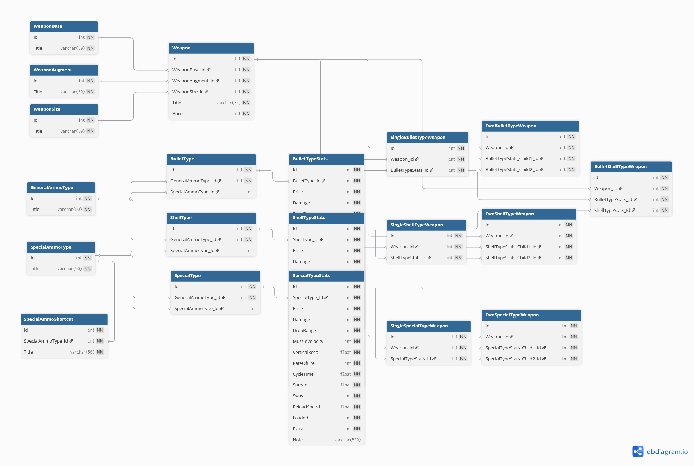

# HuntShowdownTwitchWikiAPI

This API was made to be used in Twitch chat, giving easy access to weapon information from Hunt: Showdown.

## How it works

Send a request to `https://sob.raderonlab.ca/huntwiki?q=` with a query appended to the end.

A query is simply the weapon name followed by its properties, for example:

```
centennial sniper fmj
```

Example response:
```
|Price:231| |Damage:123| |Velocity:480| |Spread:37.5| |Sway:69| |Range:125| |Magazine:9+1/12|
```

- `centennial` — weapon name
- `sniper` — variant
- `fmj` — ammo type

Weapon data is stored in a simple CSV-based database.

## The `p` separator

Use ` p ` as a separator to request specific information:

| Query | Result |
|---|---|
| `centennial sniper fmj p extended` | Extended information about the weapon |
| `centennial sniper fmj p spc damage` | Only the damage value |
| `centennial sniper fmj p spc damage range` | Damage and range values |

## Implementation notes

The program uses regular expressions to detect weapon names and keywords. Since this is meant to be typed in Twitch chat, queries are kept simple and everything is hardcoded — no extra metadata required.

## Other plans
I had plans to continue this into a better version with a full database, still planning on it. This is the schema of that DB.



```sql
CREATE TABLE [BulletShellTypeWeapon] (
    [Id] int NOT NULL,
    [Weapon_Id] int NOT NULL,
    [BulletTypeStats_Id] int NOT NULL,
    [ShellTypeStats_Id] int NOT NULL
);
CREATE TABLE [BulletType] (
    [Id] int NOT NULL,
    [GeneralAmmoType_Id] int NOT NULL,
    [SpecialAmmoType_Id] int NULL
);
CREATE TABLE [BulletTypeStats] (
    [Id] int NOT NULL,
    [BulletType_Id] int NOT NULL,
    [Price] int NOT NULL,
    [Damage] int NOT NULL,
    [DropRange] int NOT NULL,
    [MuzzleVelocity] int NOT NULL,
    [VerticalRecoil] float NOT NULL,
    [RateOfFire] int NOT NULL,
    [CycleTime] float NOT NULL,
    [Spread] float NOT NULL,
    [Sway] int NOT NULL,
    [ReloadSpeed] float NOT NULL,
    [Loaded] int NOT NULL,
    [Extra] int NOT NULL,
    [Note] varchar(500) NULL
);
CREATE TABLE [GeneralAmmoType] (
    [Id] int NOT NULL,
    [Title] varchar(50) NOT NULL
);
CREATE TABLE [ShellType] (
    [Id] int NOT NULL,
    [GeneralAmmoType_Id] int NOT NULL,
    [SpecialAmmoType_Id] int NULL
);
CREATE TABLE [ShellTypeStats] (
    [Id] int NOT NULL,
    [ShellType_Id] int NOT NULL,
    [Price] int NOT NULL,
    [Damage] int NOT NULL,
    [DropRange] int NOT NULL,
    [MuzzleVelocity] int NOT NULL,
    [VerticalRecoil] float NOT NULL,
    [RateOfFire] int NOT NULL,
    [CycleTime] float NOT NULL,
    [Spread] float NOT NULL,
    [Sway] int NOT NULL,
    [ReloadSpeed] float NOT NULL,
    [Loaded] int NOT NULL,
    [Extra] int NOT NULL,
    [Note] varchar(500) NULL
);
CREATE TABLE [SingleBulletTypeWeapon] (
    [Id] int NOT NULL,
    [Weapon_Id] int NOT NULL,
    [BulletTypeStats_Id] int NOT NULL
);
CREATE TABLE [SingleShellTypeWeapon] (
    [Id] int NOT NULL,
    [Weapon_Id] int NOT NULL,
    [ShellTypeStats_Id] int NOT NULL
);
CREATE TABLE [SingleSpecialTypeWeapon] (
    [Id] int NOT NULL,
    [Weapon_Id] int NOT NULL,
    [SpecialTypeStats_Id] int NOT NULL
);
CREATE TABLE [SpecialAmmoShortcut] (
    [Id] int NOT NULL,
    [SpecialAmmoType_Id] int NOT NULL,
    [Title] varchar(50) NOT NULL
);
CREATE TABLE [SpecialAmmoType] (
    [Id] int NOT NULL,
    [Title] varchar(50) NOT NULL
);
CREATE TABLE [SpecialType] (
    [Id] int NOT NULL,
    [GeneralAmmoType_Id] int NOT NULL,
    [SpecialAmmoType_Id] int NULL
);
CREATE TABLE [SpecialTypeStats] (
    [Id] int NOT NULL,
    [SpecialType_Id] int NOT NULL,
    [Price] int NOT NULL,
    [Damage] int NOT NULL,
    [DropRange] int NOT NULL,
    [MuzzleVelocity] int NOT NULL,
    [VerticalRecoil] float NOT NULL,
    [RateOfFire] int NOT NULL,
    [CycleTime] float NOT NULL,
    [Spread] float NOT NULL,
    [Sway] int NOT NULL,
    [ReloadSpeed] float NOT NULL,
    [Loaded] int NOT NULL,
    [Extra] int NOT NULL,
    [Note] varchar(500) NULL
);
CREATE TABLE [TwoBulletTypeWeapon] (
    [Id] int NOT NULL,
    [Weapon_Id] int NOT NULL,
    [BulletTypeStats_Child1_Id] int NOT NULL,
    [BulletTypeStats_Child2_Id] int NOT NULL
);
CREATE TABLE [TwoShellTypeWeapon] (
    [Id] int NOT NULL,
    [Weapon_Id] int NOT NULL,
    [ShellTypeStats_Child1_Id] int NOT NULL,
    [ShellTypeStats_Child2_Id] int NOT NULL
);
CREATE TABLE [TwoSpecialTypeWeapon] (
    [Id] int NOT NULL,
    [Weapon_Id] int NOT NULL,
    [SpecialTypeStats_Child1_Id] int NOT NULL,
    [SpecialTypeStats_Child2_Id] int NOT NULL
);
CREATE TABLE [Weapon] (
    [Id] int NOT NULL,
    [WeaponBase_Id] int NOT NULL,
    [WeaponAugment_Id] int NOT NULL,
    [WeaponSize_Id] int NOT NULL,
    [Title] varchar(50) NOT NULL,
    [Price] int NOT NULL
);
CREATE TABLE [WeaponAugment] (
    [Id] int NOT NULL,
    [Title] varchar(50) NOT NULL
);
CREATE TABLE [WeaponBase] (
    [Id] int NOT NULL,
    [Title] varchar(50) NOT NULL
);
CREATE TABLE [WeaponSize] (
    [Id] int NOT NULL,
    [Title] varchar(50) NOT NULL
);
```
